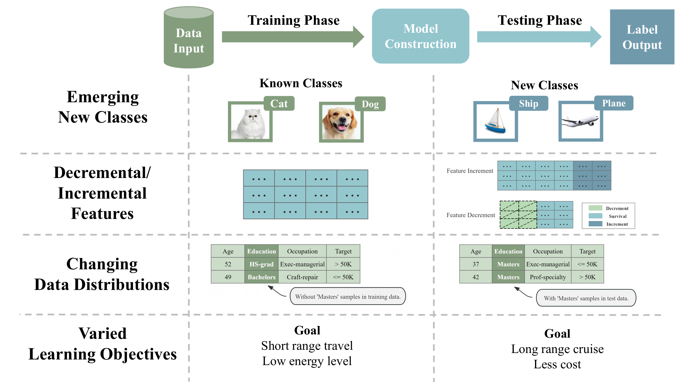
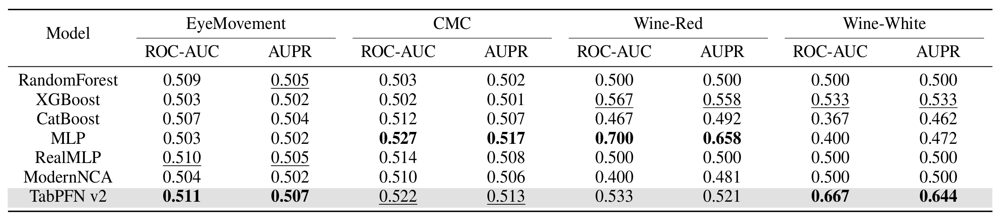
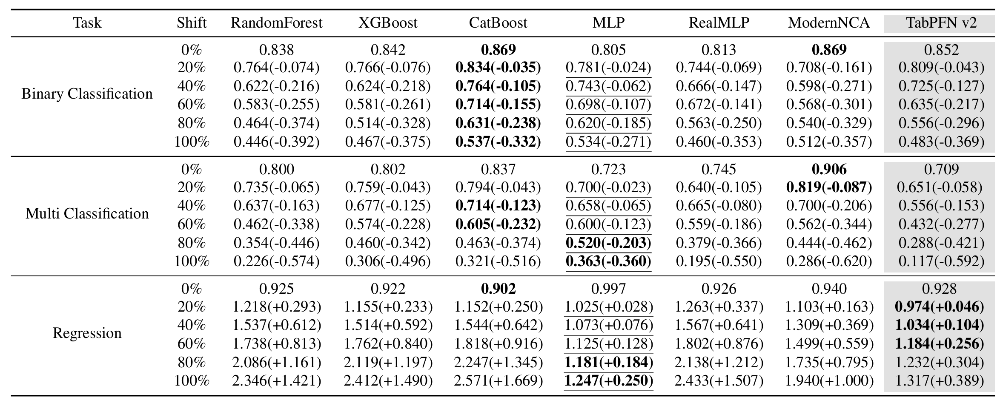
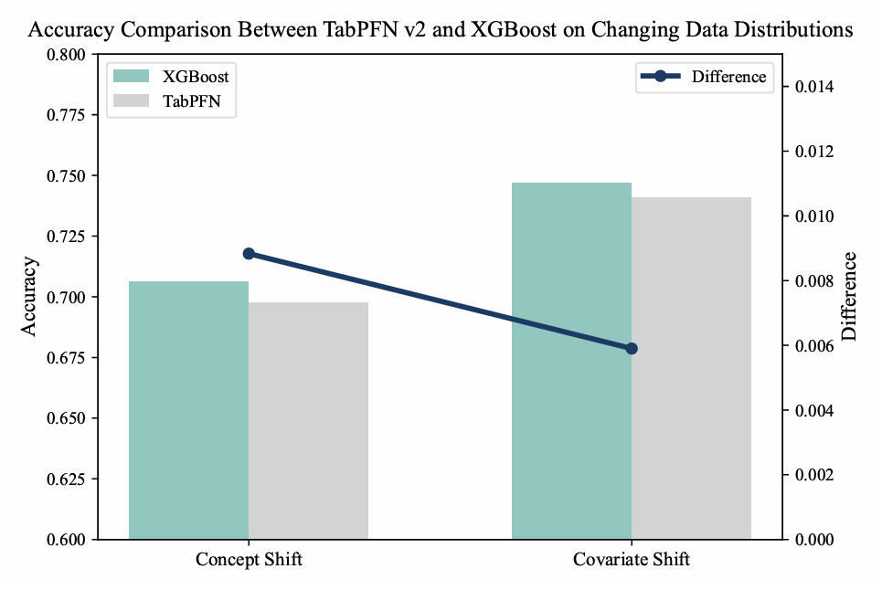
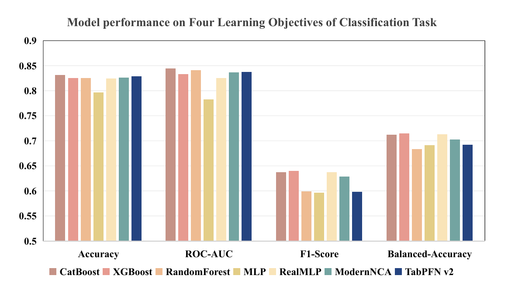
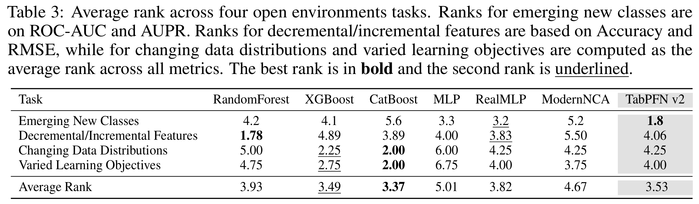

<div align="center">
    <h1>
        Realistic Evaluation of TabPFN v2.5 in Open Environments
    </h1>
</div>

## Introduction

Tabular data is widely present in real-world applications, and tree-based models have long been the dominant approach for tabular machine learning tasks. Recently, the deep learning model **TabPFN v2.5** has shown strong performance and scalability.

However, most prior work evaluates TabPFN v2.5 only in closed environments, ignoring the challenges common in **open environments**, such as:

- Emerging new classes.
- Decremental and incremental features.
- Changing data distributions.
- Varied learning objectives.

Our work is the first comprehensive evaluation of TabPFN v2.5’s robustness and adaptability under these open environment scenarios. 




## Supported Open Environment Tasks

| Task Name               | Description                                                               |
|-------------------------|---------------------------------------------------------------------------|
| Emerging New Classes     | Detecting and adapting to novel classes appearing at test time.          |
| Decremental Features    | Handling feature removal during testing.                                  |
| Incremental Features    | Adapting to newly added features during testing.                         |
| Changing Distributions  | Robustness against covariate shifts and concept drift.                   |
| Varied Learning Objectives | Maintaining performance under different objectives and class imbalances. |


## Key Observations

- TabPFN v2.5 exhibits **overall limitations** across open environment challenges.
- It shows **potential for detecting new classes**, but results are inconsistent.
- Vulnerable to **feature decrement** and unable to utilize **incremental features** during testing.
- Suffers **substantial performance degradation** under distribution shifts.
- Displays **bias towards majority classes** and fails to generalize across varied objectives.
- Robustness is highly **dependent on dataset scale**.
- **Tree-based models** remain the best option for general open environment tabular tasks.

## Recommendations
To further enhance the performance of models in open environments and to provide guidance for the development of subsequent research, the following recommendations are proposed:
 - Develop benchmarks targeting unexplored open environments tabular challenges.
 - Evaluate models on various open environments metrics.
 - Take model robustness as a critical metric when comparing model quality.
 - Design universal modules to enhance the robustness of diverse existing models.

## Quickstart

### 1. Download
Download this GitHub repository.

### 2. Set up environment
Create a new Python 3.10 environment and install 'requirements.txt'.
```bash
  conda create --name tabopen python=3.10
  pip install -r requirements.txt
```

### 3. Run evaluation

```bash
python run_evaluation.py --dataset DatasetName --model ModelName --task TaskName –-export_dataset True/False
```

* **dataset**: Full dataset name (see `./datasets` folder).
* **model**: Full model name (e.g., tabpfn, catboost).
* **task**: One of `enc`(emerging new classes), `de`(decremental features), `in`(incremental features), `ds`(data distribution shift), `vb`(varied learning objectives).
**export_dataset**: Whether to export the dataset or not. Default is 'False'.

## Benchmark Datasets

The datasets used in Decremental/Incremental Features are publicly available. You can get them from [OpenML](https://www.openml.org/) or [Kaggle](https://www.kaggle.com/). Also you can directly use them from `./datasets`. The datasets used in other three challenges are need to get them from [TableShift](https://tableshift.org/) or [WhyShift](https://github.com/namkoong-lab/whyshift).

### How to Add New Datasets

Datasets used in this paper are placed in the project's current directory, corresponding to the file name.

Each dataset folder consists of:

- `dataset.csv`, which must be included.

- `info.json`, which must include the following two contents (task can be "regression", "multiclass" or "binary", link can be from Kaggle or OpenML, num_classes is optional):
  

  ```json
  {
    "task": "binary", 
    "link": "www.kaggle.com",
    "num_classes":
  }
  ```

## Models

Our work supports evaluating three categories of models directly: tree-based models and deep learning models.

#### Tree-based models
1. **[CatBoost](https://catboost.ai/)**: A powerful gradient boosting library designed for efficient handling of categorical features and robust tabular data modeling.

2. **[XGBoost](https://xgboost.readthedocs.io/en/latest/)**: A scalable and efficient implementation of gradient boosted trees widely used in tabular data tasks.

3. **RandomForest**: a classical ensemble learning method based on bagging and decision trees.

#### Deep learning models
1. **MLP**: A standard multilayer perceptron neural network, implemented following the approach in [RTDL](https://arxiv.org/abs/2106.11959).

2. **[ModernNCA](https://arxiv.org/abs/2407.03257)**: A deep tabular model inspired by Neighbor Component Analysis, leveraging learned embeddings and neighbor relations for prediction.

3. **[RealMLP](https://arxiv.org/abs/2407.04491)**: An enhanced multilayer perceptron architecture designed for improved tabular learning.

4. **[TabPFN v2.5](https://arxiv.org/abs/2511.08667)**: A pre-trained neural network model applicable to various tabular tasks. Our work supports evaluation TabPFN v2.5.

### How to Add New Models

We provide two methods to evaluate new model on experiments.

1. Export the dataset. Set export_dataset as True, then can get a csv file of a given dataset in a specific experiment.
2. Import model python file.
   - Add the model name in `./run_experiment.py`.
   - Add the model function in the `./model/utils.py` by leveraging parameters like dataset, model, train_set and test_sets.

## Experimental Results
#### 1. Emerging New Classes.
 - TabPFN v2.5 has the potential to detect new classes.


#### 2. Decremental/Incremental Features.
 - TabPFN v2.5 exhibits heightened vulnerability to decremental features.
 - TabPFN v2.5 can not address new added features in the testing phase.


#### 3. Changing Data Distributions.
 - TabPFN v2.5 reveals limited robustness when concepts shift.


#### 4. Varied Learning Objectives.
 - TabPFN v2.5 has statistically significant bias toward majority classes.
 - TabPFN v2.5 fails to maintain competitive performance across various learning objectives.


#### 5. Holistic Assessment.
 - TabPFN v2.5's robustness is inherently data-dependent.

